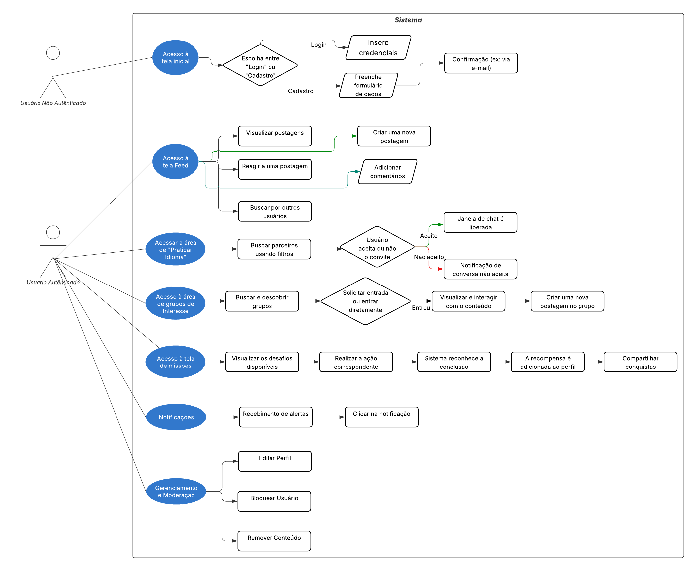
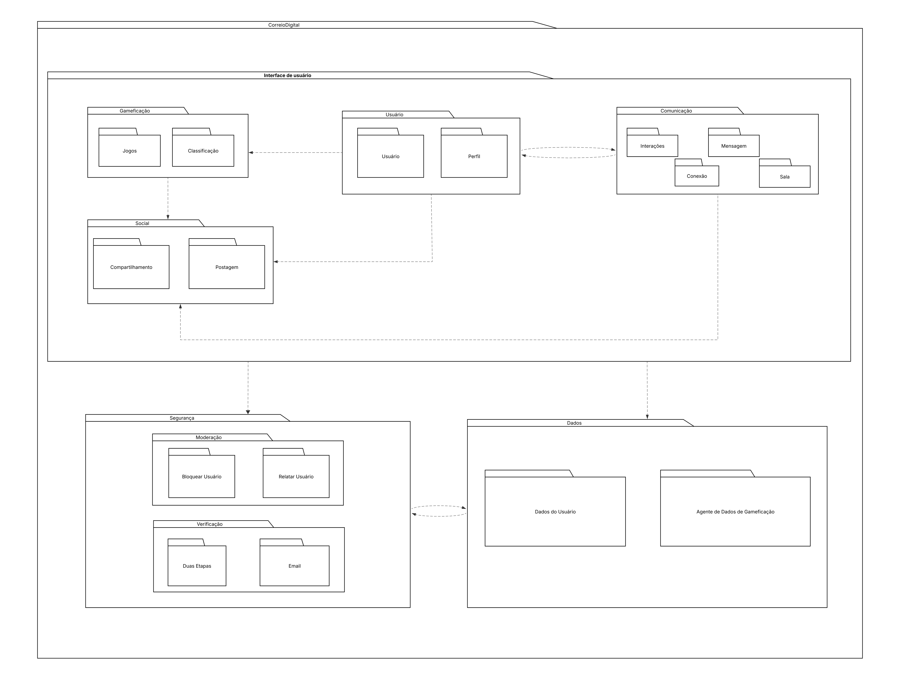
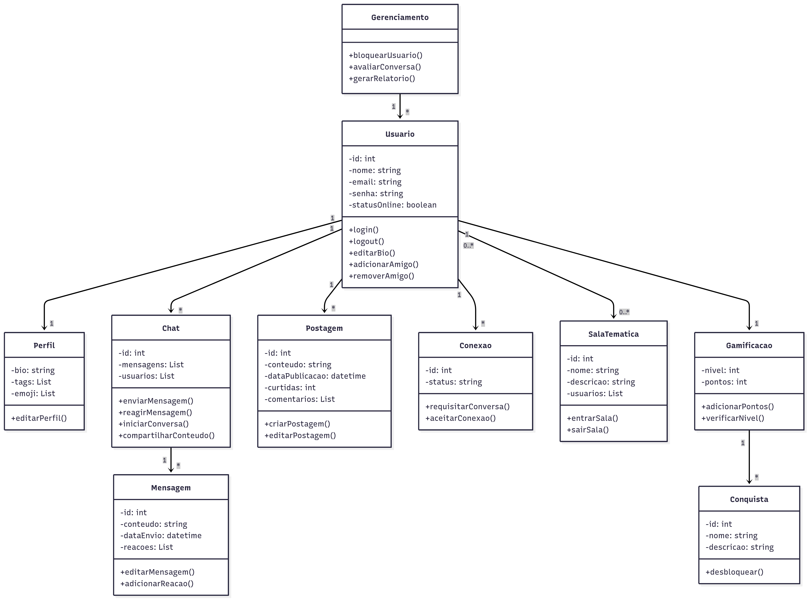

# 4.1 Documento de Arquitetura de Software (DAS)

## Introdução

O **Correio Digital** (também conhecido como BabelChat) é uma plataforma web cujo objetivo principal é conectar pessoas interessadas em aprender e praticar diferentes idiomas. O sistema oferece funcionalidades de criação de perfil, gerenciamento de interesses, publicação de posts, adição de amigos e um sistema de chat interativo para prática de conversação.

### Propósito
O sistema foi desenvolvido para facilitar o aprendizado de idiomas através da interação social, permitindo que usuários pratiquem conversas em tempo real com falantes nativos ou outros estudantes, criando um ambiente colaborativo e engajador.

### Público-Alvo
- Estudantes de idiomas que buscam prática conversacional
- Pessoas interessadas em intercâmbio cultural e linguístico
- Usuários que desejam aprimorar suas habilidades de comunicação em línguas estrangeiras

### Escopo do Documento
Este Documento de Arquitetura de Software (DAS) apresenta uma visão abrangente da arquitetura do sistema Correio Digital, descrevendo suas principais decisões arquiteturais, componentes, padrões de projeto utilizados e características de qualidade. O documento serve como guia técnico para desenvolvedores, arquitetos e stakeholders do projeto.

[[1](#ref1)]

---

##  Representação Arquitetural

### Abordagem Arquitetural
O sistema Correio Digital adota uma **arquitetura em camadas** baseada no modelo **Cliente-Servidor**, com separação clara de responsabilidades entre apresentação, lógica de negócio e persistência de dados.

### Componentes Principais

#### 1. Camada de Frontend/Interface
- **Tecnologia**: Next.js / React
- **Responsabilidades**: Gerenciamento de perfis, chat, exploração de usuários, publicações (feed)
- **Componentes**: InterfacePerfil, InterfaceChat, InterfaceGrupo, InterfaceApp

#### 2. Camada de Backend/Operações
- **Tecnologia**: FastAPI (Python) / Java
- **Responsabilidades**: Lógica de negócio, autenticação, notificações, gerenciamento de chat, sugestão de amigos, gamificação
- **Serviços**: ControladorAutenticacao, ControladorChat, ControladorNotificacoes, ControladorGamificacao

#### 3. Camada de Dados
- **Tecnologia**: PostgreSQL (banco relacional)
- **Responsabilidades**: Persistência de usuários, mensagens, conversas, perfis, conquistas
- **Componentes**: BancoDeDados, BancoDeDadosGamificacao

#### 4. Serviços Externos
- **APIs de Tradução**: Google Translate, DeepL (via padrão Adapter)
- **Sistema de Notificações**: E-mail e SMS (via padrão Abstract Factory)

### Estilo Arquitetural
O sistema segue os princípios de **Arquitetura em Camadas** com aplicação extensiva de **Padrões de Projeto GoF**, incluindo:
- **Criacionais**: Factory Method, Abstract Factory, Builder, Singleton
- **Estruturais**: Adapter, Facade, Decorator, Composite
- **Comportamentais**: Strategy, Command, State

[[2](#ref2),[[3](#ref3)]]

## 4.1.3 Metas e Restrições Arquiteturais

### Metas
- **Alta Disponibilidade**: Sistema acessível 24/7 para suportar usuários em diferentes fusos horários
- **Segurança Robusta**: Proteção de dados pessoais, autenticação segura (JWT), criptografia de mensagens
- **Baixa Latência**: Mensagens em tempo real com resposta rápida no chat
- **Escalabilidade**: Suporte ao crescimento de usuários e volume de mensagens
- **Usabilidade**: Interface intuitiva similar a aplicativos de mensagem conhecidos (WhatsApp)
- **Gamificação**: Sistema de pontos e conquistas para engajar usuários no aprendizado

### Restrições
- **Tecnológicas**: Uso obrigatório de padrões de projeto GoF conforme requisitos acadêmicos
- **Conformidade**: Suporte a múltiplos idiomas através de APIs de tradução externas
- **Desempenho**: Tradução automática dependente de APIs de terceiros (Google Translate, DeepL)
- **Orçamento**: Projeto acadêmico sem custos de infraestrutura complexa
- **Tempo**: Desenvolvimento conforme cronograma da disciplina de Arquitetura e Desenho de Software
- **Plataforma**: Aplicação web responsiva compatível com navegadores modernos

[[2](#ref2)]

---

##  Visualização de Caso de Uso

Os principais casos de uso do sistema Correio Digital refletem as funcionalidades essenciais para a prática de idiomas e interação social.

### UC01 - Enviar Mensagem de Texto

<details>
<summary><b>UC01 - Enviar Mensagem de Texto</b></summary>

| Campo | Descrição |
|---|---|
| Nome | Enviar Mensagem de Texto |
| Ator Principal | Usuário Estudante |
| Atores Secundários | Sistema de Notificação, Banco de Dados |
| Pré-condições | Usuário autenticado, Conversa iniciada ou existente |
| Pós-condições | Mensagem armazenada e entregue ao destinatário |
| Fluxo Principal | 1. Usuário seleciona conversa<br>2. Digita mensagem<br>3. Sistema valida conteúdo<br>4. Sistema armazena mensagem<br>5. Sistema notifica destinatário<br>6. Mensagem exibida no chat |
| Fluxo Alternativo | Se usuário estiver offline, mensagem é armazenada e entregue quando online |
| Regras de Negócio | RN01: Mensagens suportam texto, emoji e reações<br>RN02: Histórico de conversas preservado |

</details>

### UC02 - Traduzir Mensagem

<details>
<summary><b>UC02 - Traduzir Mensagem</b></summary>

| Campo | Descrição |
|---|---|
| Nome | Traduzir Mensagem |
| Ator Principal | Usuário Estudante |
| Atores Secundários | API de Tradução (Google/DeepL), Sistema de Cache |
| Pré-condições | Mensagem recebida em idioma diferente do configurado |
| Pós-condições | Mensagem exibida no idioma desejado |
| Fluxo Principal | 1. Usuário solicita tradução<br>2. Sistema identifica idioma de origem<br>3. Sistema consulta API de tradução<br>4. Sistema armazena tradução em cache<br>5. Tradução exibida ao usuário |
| Fluxo Alternativo | Se API falhar, tenta serviço alternativo (padrão Adapter com fallback) |
| Regras de Negócio | RN03: Suporte a múltiplos idiomas<br>RN04: Cache de traduções para reduzir custo de API |

</details>

### UC03 - Gerenciar Perfil

<details>
<summary><b>UC03 - Gerenciar Perfil</b></summary>

| Campo | Descrição |
|---|---|
| Nome | Gerenciar Perfil de Usuário |
| Ator Principal | Usuário Estudante |
| Atores Secundários | Sistema de Validação |
| Pré-condições | Usuário autenticado |
| Pós-condições | Perfil atualizado com novas informações |
| Fluxo Principal | 1. Usuário acessa seu perfil<br>2. Edita biografia, tags de idiomas, emoji<br>3. Sistema valida informações<br>4. Sistema persiste alterações<br>5. Confirmação exibida |
| Fluxo Alternativo | Se dados inválidos, sistema exibe mensagem de erro |
| Regras de Negócio | RN05: Bio limitada a 500 caracteres<br>RN06: Tags representam idiomas de interesse |

</details>

### UC04 - Adicionar Amigo

<details>
<summary><b>UC04 - Adicionar Amigo/Conexão</b></summary>

| Campo | Descrição |
|---|---|
| Nome | Adicionar Amigo |
| Ator Principal | Usuário Estudante |
| Atores Secundários | Sistema de Sugestões, Sistema de Notificação |
| Pré-condições | Usuário autenticado, Perfil do amigo visualizado |
| Pós-condições | Conexão estabelecida, Notificação enviada |
| Fluxo Principal | 1. Usuário busca ou recebe sugestão de amigo<br>2. Visualiza perfil<br>3. Envia solicitação de amizade<br>4. Sistema notifica destinatário<br>5. Destinatário aceita<br>6. Conexão criada |
| Fluxo Alternativo | Se solicitação recusada, conexão não é criada |
| Regras de Negócio | RN07: Matching baseado em idiomas de interesse<br>RN08: Sugestões inteligentes de amigos |

</details>

### UC05 - Participar de Sala Temática

<details>
<summary><b>UC05 - Participar de Sala Temática</b></summary>

| Campo | Descrição |
|---|---|
| Nome | Participar de Sala Temática |
| Ator Principal | Usuário Estudante |
| Atores Secundários | Sistema de Salas, Moderador |
| Pré-condições | Usuário autenticado, Sala existente ou criada |
| Pós-condições | Usuário membro da sala, pode enviar mensagens em grupo |
| Fluxo Principal | 1. Usuário explora salas disponíveis<br>2. Seleciona sala de interesse (por idioma/tema)<br>3. Solicita entrada<br>4. Sistema adiciona à sala<br>5. Usuário pode interagir no chat em grupo |
| Fluxo Alternativo | Se sala privada, requer aprovação do moderador |
| Regras de Negócio | RN09: Salas organizadas por idioma e tema<br>RN10: Suporte a múltiplos participantes |

</details>

**Figura 1:** Representação UML do Diagrama de Caso de Uso (Usuário)



**Autoria**: [Esther Sena](https://github.com/esmsena) e [Mariiana Neris](https://github.com/Maryyscreuza), 2025.

[[4](#ref4)]

----

##  Visualização Lógica

A organização do sistema segue uma arquitetura em três camadas principais:

### Camadas Lógicas

#### Camada de Apresentação (Frontend)
- **Tecnologia**: Next.js, React
- **Componentes**:
  - `InterfacePerfil`: Gerenciamento de perfis de usuário
  - `InterfaceChat`: Sistema de mensagens em tempo real
  - `InterfaceGrupo`: Gerenciamento de salas temáticas e grupos
  - `InterfaceApp`: Dashboard principal e navegação
  - `InterfaceExplorar`: Busca e descoberta de usuários

#### Camada de Lógica de Negócio (Backend)
- **Tecnologia**: FastAPI (Python) / Java
- **Pacotes**:
  - `Operações`: Serviços principais do sistema
    - `ControladorAutenticacao`: Gerenciamento de login/logout/sessões
    - `ControladorChat`: Lógica de mensagens em tempo real
    - `ControladorNotificacoes`: Envio de alertas e notificações
    - `ServicoTraducao`: Integração com APIs de tradução (padrão Adapter)
    - `SugerirAmigos`: Algoritmo de matching baseado em idiomas
    - `ControladorGamificacao`: Sistema de pontos e conquistas
  - `Segurança`: Autenticação, autorização e validação
  - `Idiomas`: Gerenciamento de múltiplos idiomas e traduções

#### Camada de Persistência (Dados)
- **Tecnologia**: PostgreSQL
- **Componentes**:
  - `BancoDeDados`: Persistência de usuários, mensagens, conversas
  - `BancoDeDadosGamificacao`: Persistência de pontos, conquistas, ranking
  - `RepositorioUsuario`: Operações CRUD de usuários
  - `RepositorioMensagem`: Operações CRUD de mensagens
  - `RepositorioConversa`: Gerenciamento de conversas e histórico

**Figura 2:** Diagrama de Pacotes



**Autoria**: Esther Sena, Mariiana Neris, 2025.

### Classes Principais e Relacionamentos

**Figura 3:** Diagrama de Classes



**Autoria**: João Pedro Costa, Julia Gabriela, 2025.

#### 1. Classe `Usuario`
```java
class Usuario {
  - id: int
  - nome: string
  - email: string
  - senha: string
  - idiomaNativo: string
  - idiomasInteresse: List<string>
  
  + autenticar(): boolean
  + atualizarPerfil(): void
  + adicionarAmigo(usuario: Usuario): void
  + removerAmigo(usuario: Usuario): void
  + criarPostagem(): Postagem
  + participarChat(chat: Chat): void
}
```

#### 2. Classe `Perfil`
```java
class Perfil {
  - bio: string
  - tags: List<string>
  - emoji: List<string>
  
  + editarPerfil(): void
  + visualizarPerfil(): void
}
```

#### 3. Classe `Chat`
```java
class Chat {
  - id: int
  - mensagens: List<Mensagem>
  - usuarios: List<Usuario>
  - tipo: TipoChat // INDIVIDUAL, GRUPO
  
  + enviarMensagem(conteudo: string): void
  + reagirMensagem(mensagem: Mensagem, reacao: string): void
  + iniciarConversa(usuario: Usuario): void
  + compartilharConteudo(arquivo: File): void
}
```

#### 4. Classe `Mensagem`
```java
class Mensagem {
  - id: int
  - conteudo: string
  - dataEnvio: datetime
  - remetente: Usuario
  - reacoes: List<Reacao>
  - traduzida: boolean
  
  + editarMensagem(novoConteudo: string): void
  + adicionarReacao(reacao: string): void
  + traduzir(idiomaDestino: string): string
}
```

#### 5. Classe `Gamificacao`
```java
class Gamificacao {
  - nivel: int
  - pontos: int
  - usuario: Usuario
  
  + adicionarPontos(quantidade: int): void
  + verificarNivel(): void
  + desbloquearConquista(conquista: Conquista): void
}
```

#### 6. Classe `SalaTematica`
```java
class SalaTematica {
  - id: int
  - nome: string
  - descricao: string
  - idioma: string
  - tema: string
  - usuarios: List<Usuario>
  - moderador: Usuario
  
  + entrarSala(usuario: Usuario): void
  + sairSala(usuario: Usuario): void
  + enviarMensagemGrupo(mensagem: Mensagem): void
}
```

#### Relacionamentos Principais
- `Usuario` (1) --- (1) `Perfil`: Associação
- `Usuario` (1) --- (N) `Chat`: Associação
- `Chat` (1) --- (N) `Mensagem`: Composição
- `Usuario` (1) --- (1) `Gamificacao`: Associação
- `Gamificacao` (1) --- (N) `Conquista`: Composição

[[3](#ref3)]

-----

## Visualização de Processo

[Descreva os processos e threads principais do sistema.]

- Processo do Cliente: [Descrição]
- Processo do Servidor (API): [Descrição]
- Processo Assíncrono (Ex: Fila de envio): [Descrição]

## Visualização de Deploy

[Descreva a infraestrutura e como o software será implantado.]

- Frontend: [Plataforma de Deploy, ex: Vercel]
- Backend e Banco de Dados: [Plataforma de Deploy, ex: AWS, Render]

**Figura 4:** Diagrama de Deploy (ou Arquitetura em Camadas Físicas)

**Autoria**: [Seu Nome], 2025.

##  Visualização de Implementação

Diagrama de componentes

[Descreva os subsistemas e seus componentes de software.]

**Figura 5:** Diagrama de Componentes

**Autoria**: [Seu Nome], 2025.

### Subsistemas e Componentes

- **Subsistema de [Nome 1]**
  - [Componente 1]: [Descrição da responsabilidade]
  - [Componente 2]: [Descrição da responsabilidade]
- **Subsistema de [Nome 2]**
  - [Componente 3]: [Descrição da responsabilidade]
- **Subsistema de [Nome 3]**
  - [Componente 4]: [Descrição da responsabilidade]

##  Visualização de Dados

[Descreva o modelo de dados do sistema.]

**Figura 6:** DER (Diagrama Entidade-Relacionamento)

**Autoria**: [Seu Nome], 2025.

### MER – Modelo Entidade Relacionamento

[ENTIDADE 1, ex: USUARIO]
- Atributos:
  - [atributo_pk] (PK)
  - [atributo_2]
- Relacionamentos:
  - Relacionamento [ENTIDADE 2] (Cardinalidade)

[ENTIDADE 2, ex: MENSAGEM]
- Atributos:
  - [atributo_pk] (PK)
  - [atributo_2]
  - [atributo_fk] (FK)
- Relacionamentos:
  - Relacionamento [ENTIDADE 3] (Cardinalidade)

### DLD – Dicionário de Dados

Tabela: [NOME_TABELA_1]

| Campo | Tipo | Chave | Obrigatório | Descrição |
|---|---|---|---|---|
| [campo_1] | [tipo] | [PK/FK] | [Sim/Não] | [Descrição] |
| [campo_2] | [tipo] |  | [Sim/Não] | [Descrição] |

Tabela: [NOME_TABELA_2]

| Campo | Tipo | Chave | Obrigatório | Descrição |
|---|---|---|---|---|
| [campo_1] | [tipo] | [PK/FK] | [Sim/Não] | [Descrição] |
| [campo_2] | [tipo] |  | [Sim/Não] | [Descrição] |

Resumo dos Relacionamentos

- [ENTIDADE 1] – [ENTIDADE 2] (Cardinalidade) (Descrição)
- [ENTIDADE 1] – [ENTIDADE 3] (Cardinalidade) (Descrição)

##  Qualidade

[Descreva os atributos de qualidade (requisitos não-funcionais) e como a arquitetura os atende.]

- Usabilidade: [Estratégia, ex: Interface responsiva]
- Segurança: [Estratégia, ex: Autenticação JWT, HTTPS]
- Escalabilidade: [Estratégia, ex: Deploy em contêineres]
- Performance: [Estratégia, ex: Uso de cache]

##  Diagrama de Atividades

[Descreva o fluxo de controle de atividades-chave.]

[Atividade 1, ex: Enviar E-mail]

**Figura 7:** Diagrama de Atividade [Nome da Atividade 1]

**Autoria**: [Seu Nome], 2025.

[Atividade 2, ex: Ler E-mail]

**Figura 8:** Diagrama de Atividade [Nome da Atividade 2]

**Autoria**: [Seu Nome], 2025.

##  Código Comprobatório

[Forneça exemplos de código que demonstram a implementação dos padrões arquiteturais.]

### Exemplo de Código: [Padrão, ex: Cliente-Servidor]

Código do Cliente (Frontend - [Tecnologia, ex: Next.js])

```javascript
// [Arquivo, ex: frontend/src/services/api.ts]

// [Exemplo de código que faz a chamada de API]
```

Código do Servidor (Backend - [Tecnologia, ex: FastAPI])

```python
# [Arquivo, ex: backend/app/routers/email.py]

# [Exemplo de código do endpoint da API que recebe a chamada]
```

##  Gerenciamento e Controle

###  Reflexões Críticas e Justificativas

[Discuta as principais decisões de design e seus trade-offs.]

#### Trade-offs e Decisões
[Descreva a principal escolha de design e suas vantagens/desvantagens. Ex: A escolha de um banco de dados relacional (PostgreSQL) em vez de JSON/NoSQL, justificando pela necessidade de transações e integridade referencial.]

#### Justificativa da Visão Arquitetural Adicional
[Justifique por que uma visão específica (ex: Visão de Dados) foi detalhada e é arquiteturalmente significativa para o seu projeto.]

#### Desafios e Melhorias
[Descreva os principais desafios técnicos enfrentados ou previstos e possíveis melhorias futuras na arquitetura.]

## Referências Bibliográficas

  1. <a id="ref1"></a> [Conceitos gerais de documentação arquitetural IEEE 1471-2000 - Recommended Practice for Architectural Description (estrutura e propósito do DAS)](https://sol.sbc.org.br/index.php/sbqs/article/download/15608/15451/)
  2. <a id="ref2"></a> [BASS, Len; CLEMENTS, Paul; KAZMAN, Rick - Software Architecture in Practice (arquitetura em camadas, estilos arquiteturais) ](https://ptgmedia.pearsoncmg.com/images/9780321815736/samplepages/0321815734.pdf)
  3. <a id="ref3"></a> [GAMMA, Erich et al. - Design Patterns (padrões GoF mencionados)](https://www.kufunda.net/publicdocs/Padr%C3%B5es%20de%20Projetos%20Solu%C3%A7%C3%B5es%20Reutiliz%C3%A1veis%20(Gamma,%20Erich%20%20johnson,%20Ralph%20%20Helm%20etc.).pdf)
  4. <a id="ref4"></a> [Metodologia UML padrão para casos de uso
Repositórios do projeto (Entrega_01 - casos de uso documentados)](https://github.com/UnBArqDsw2025-2-Turma01/2025.2-T01-G2_CorreioDigital_Entrega_01/tree/main/docs/Base)
  5. <a id="ref5"></a> 

  
## Histórico de Versões

| Versão | Data | Descrição | Autor(a) | Revisor(a) |
|---|---|---|---|---|
| 1.0 | 14/11/2025 | Criação do documento inicial/esqueleto | [Esther Sena](https://github.com/esmsena)  | - |
| 1.1 | 17/11/2025  | Adicionando tópicos Introdução, Representação Arquitetural,Metas e Restrições ,Visão de Casos de Uso, Visão Lógica | [Esther Sena](https://github.com/esmsena) | - |
| 1.2 | 17/11/2025  | Adicionando imagens e referências| [Esther Sena](https://github.com/esmsena) | - |

